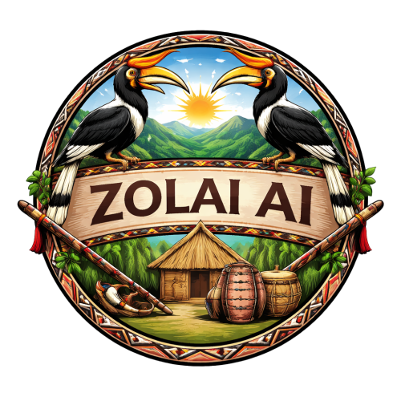

# Zolai AI Wiki — Second Brain Knowledge Base

> **Language:** Tedim Chin (ISO 639-3: ctd) — ZVS Standard Dialect
> The central knowledge repository for the **Zolai Second Brain** project — linguistic rules, grammar, vocabulary, culture, curriculum, and training strategy for the Tedim Zolai language.
> **Author:** Peter Pau Sian Lian ([@peterpausianlian](https://huggingface.co/peterpausianlian))

---

## 🧠 Architecture & Concepts

- [Chat System](concepts/chat_system.md) — AI tutor operational logic
- [Domain Routing](concepts/domain_routing_architecture.md) — Request classification
- [Socratic Philosophy](concepts/socratic_philosophy.md) — "Sangsia" (Teacher) pedagogy
- [Psycholinguistic Architecture](concepts/psycholinguistic_architecture.md) — Lung-Kha framework

---

## 📖 Linguistic Standards (ZVS — Tedim Dialect)

### Grammar
- [Phonology & Orthography](grammar/phonology.md) — Roman alphabet, tone system
- [Morphemics](grammar/morphemics.md) — Word formation, compound rules
- [Verb Stems](grammar/verb_stems.md) — Stem I vs Stem II mapping
- [Tense Markers](grammar/tense_markers.md) — `khin`, `ding`, `ngei`, `zo`, `lai`
- [Particle Differentiations](grammar/particle_differentiations.md) — `uh hi`, `ahi hi`, G vs Ng
- [Advanced Syntax](grammar/advanced_syntax.md) — Complex sentences, conditionals
- [Sentence Structures](grammar/sentence_structures.md) — SOV patterns
- [Biblical Sentence Patterns](grammar/biblical_sentence_patterns.md)
- [Tones](grammar/tones.md) — 14-toneme system
- [Verb Aspects](grammar/verb_aspects.md)
- [Ergative `in`](grammar/ergative_in.md) — Agent marking
- [Punctuation](grammar/punctuation.md) — Pawfi, comma, period rules
- [Core Grammar Reference](grammar/core_grammar_reference.md)
- [ZVS Standard Format Rules](grammar/zolai_standard_format_rules.md)

### Quick References
- [Grammar Cheat Sheet](grammar/zolai_grammar_cheat_sheet.md)
- [ZVS Standard Format](grammar/Zolai_Standard_Format.md)

---

## 📚 Vocabulary

- [Vocabulary Index](vocabulary/README.md)
- [Common Phrases](vocabulary/common_phrases.md)
- [Modern Technology](vocabulary/modern_technology.md)
- [Theology](vocabulary/theology.md)
- [Idioms & Metaphors](vocabulary/idioms_and_metaphors.md)
- [Vocabulary Recommendations](vocabulary/vocab_recommendations.md)
- [Zolai Compound Words](vocabulary/zo_compound_words.md)
- [CEFR Wordlists](vocabulary/wordlists/) — A1, A2, B1, B2, C1

---

## 🎓 Curriculum (CEFR A1–C2)

- [A1 Beginner](curriculum/a1_beginner.md)
- [A2 Elementary](curriculum/a2_elementary.md)
- [B1 Intermediate](curriculum/b1_intermediate.md)
- [B2 Upper Intermediate](curriculum/b2_upper_intermediate.md)
- [C1 Advanced](curriculum/c1_advanced.md)
- [C2 Mastery](curriculum/c2_mastery.md)

---

## 🤖 Training & AI

- [AI Second Brain](training/ai_second_brain.md)
- [LLM Training Roadmap](training/llm_training_roadmap.md)
- [Dataset Specs](training/dataset_specs.md)
- [Data Pipeline & Strategy](training/data_pipeline_and_training_strategy.md)
- [Evaluation Benchmarks](training/evaluation_benchmarks.md)
- [Curriculum to Training Pipeline](training/curriculum_to_training_pipeline.md)
- [Low Resource NLP Research](training/low_resource_nlp_research.md)
- [Zolai AI Instructions](training/zolai_ai_instructions.md) — language AI processing guide (ground truth)
- [Zolai System Prompt](training/zolai_system_prompt.txt) — canonical system prompt

---

## 🌍 Culture & History

- [Historical Origins](culture/historical_origins.md)
- [Traditional Customs](culture/traditional_customs.md)
- [Khuado](culture/khuado.md)
- [Future of Zolai](culture/future_of_zolai.md)
- [Zomi Comprehensive](culture/zomi_comprehensive.md)
- [Historical Milestones](culture/historical_milestones.md)
- [Bible History](culture/zolai_bible_history.md)

---

## 📖 Literature

- [Folklore & Idioms](literature/folklore_idioms.md)
- [Poetry & Songs](literature/poetry_and_songs.md)
- [Proverbs & Wisdom](literature/proverbs_and_wisdom.md)
- [Sermon Register](literature/sermon_register.md)
- [ZomiDaily Style](literature/zomidaily_style_v2.md)

---

## 📝 Translation & Register

- [Translation Decision Patterns](translation/decision_patterns.md)
- [English to Zolai Mapping](translation/english_to_zolai_mapping.md)
- [Idioms](translation/idioms.md)
- [Register Guide](grammar/register_guide.md)
- [Social Registers](grammar/social_registers.md)

---

## 📖 Biblical

- [Books Summary](biblical/books_summary.md)
- [Biblical Sentence Patterns](grammar/biblical_sentence_patterns.md)
- [Comparative Book Patterns](biblical/comparative_book_patterns.md)
- [Worship Linguistic Standards](biblical/worship_linguistic_standards.md)

---

## 🧩 Linguistic Deep Dives

All formerly standalone directories have been merged into `grammar/`:

- [Negation Guide](grammar/negation_guide.md)
- [Number System](grammar/number_system.md)
- [Particle Index](grammar/particle_index.md)
- [Pronoun Guide](grammar/pronoun_guide.md)
- [Common Mistakes](grammar/common_mistakes.md)

---

## 🔬 Linguistics

- [Tedim Pau Language Reference](linguistics/tedim_pau_language_reference.md)
- [Zolai Sinna 2010 Knowledge](linguistics/zolai_sinna_2010_knowledge.md)
- [Search and Translation Patterns](linguistics/search_and_translation_patterns.md)

---

## 🧪 Testing

- [Phrase Extraction Final Report](testing/phrase_extraction_final_report.md)
- [Model Comparison Report](testing/model_comparison_report.md)

---

## 📦 Bundle

- [Bundle](bundle/) — Compiled wiki bundles for NotebookLM / offline use

---

## 📚 Docs

- [Competitive Features Roadmap](docs/competitive_features_roadmap.md)
- [NotebookLM Complete](docs/zolai_notebooklm_complete.md) — full pedagogical reference
- [Wiki Enrichment Guide](docs/WIKI_ENRICHMENT_GUIDE.md)

---

## 🧠 Memory

- [Short-Term Memory](memory/short_term.md) — Current session state
- [Long-Term Memory](memory/long_term.md) — Project milestones and decisions

---

## 🗂️ Planning & Changelog

- [CHANGELOG](planning/CHANGELOG.md)
- [SMART Goals Roadmap](planning/smart_goals_roadmap.md)
- [Contributor Guide](planning/contributor_guide.md)
- [SWOT Audit 2026](planning/swot_smart_audit_2026_04_18.md)

---

## 🗂️ Dictionary Rebuild History

All dictionary rebuild docs are archived:

- [Dictionary Rebuild v2](archive/dictionary_rebuild_v2/README.md)
- [Dictionary Rebuild v3](archive/dictionary_rebuild_v3/README.md)
- [Dictionary Rebuild v5](archive/dictionary_rebuild_v5/README.md)
- [Learning Summary (2026-04-22)](archive/LEARNING_SUMMARY_2026_04_22.md)

---

## ZVS Dialect Rules (Quick Reference)

| ✅ Use | ❌ Never |
|--------|---------|
| `pasian` | `pathian` |
| `gam` | `ram` |
| `tapa` | `fapa` |
| `topa` | `bawipa` |
| `kumpipa` | `siangpahrang` |
| `tua` | `cu` / `cun` |

- Word order: **SOV** (Subject-Object-Verb)
- Negation: `kei` not `lo` for conditionals (`nong pai kei a leh` — NEVER `kei a leh`)
- Plural: never combine `uh` with `i` (we) — `I pai hi` ✅, `I pai-te hi` ❌
- `o` is always /oʊ/ — never pure /o/

---

## Current Models (2026-04-20)

| Model | Base | Method | Status |
|-------|------|--------|--------|
| [`zolai-qwen-0.5b`](https://huggingface.co/peterpausianlian/zolai-qwen-0.5b) | Qwen2.5-0.5B-Instruct | LoRA FP16 r=16 α=32, T4x2 | Training: chunk 300k–800k / 5.1M |
| [`zolai-qwen2.5-3b-lora`](https://huggingface.co/peterpausianlian/zolai-qwen2.5-3b-lora) | Qwen2.5-3B-Instruct | QLoRA 4-bit NF4 r=8 α=16, T4 | Training: chunk 300k+ |

---

**Last Updated: 2026-09-05**

---

## Part of the Zolai-AI org

This repo is a component of the **[Zolai-AI](https://github.com/Zolai-AI)** organization — see the
[org profile](https://github.com/Zolai-AI) for the full ecosystem and
[`.github/CONTRIBUTING.md`](https://github.com/Zolai-AI/.github/blob/main/CONTRIBUTING.md) to contribute.

`zolai-core` · `zolai-web` · `zolai-tauri` · `zolai-datasets` · `zolai-training` · `zolai-wiki` · `zolai-ai.github.io`

---

## Org context

Full project ecosystem, architecture, design, status & plans: **[Zolai AI Project Brain](https://github.com/Zolai-AI/.github/blob/main/docs/ZOLAI_AI_PROJECT_BRAIN.md)**.
Part of the [Zolai-AI](https://github.com/Zolai-AI) org.

---

## 📊 Data Sources

This wiki is built from the following data sources. **Full credits:** See [`data/CREDITS.md`](https://github.com/Zolai-AI/zolai-datasets/blob/main/data/CREDITS.md)

### Bible (Primary Corpus)
- **Source:** [dalsuum/bible-master](https://github.com/dalsuum/bible-master)
- **Versions:** Tedim 1932, Tedim 2010, TDB77, Hakha 1920, Falam 1973, Paite 1971
- **Entries:** 31,102 parallel verses (EN↔ZO)
- **Why:** Only complete, trusted EN/ZO parallel corpus available

### Dictionary
- **Zolai→English:** 93,931 entries ([ZomiLanguage/dictionary](https://github.com/ZomiLanguage/dictionary))
- **English→Zolai:** 112,220 entries
- **Trilingual:** 7,861 headwords ([dalsuum/zolai-dictionary](https://github.com/dalsuum/zolai-dictionary))
- **TongDot:** 5,004 entries
- **Glosbe:** Tedim-English translation examples

### Reference Materials
- **Zolai Grammar Vol 1** — Taang Zomi (2010) — 17,196 lines
- **Zolai Sinna** — ZAUS (2010) — 6,259 lines (34 lessons)
- **ZVS 2018** — Zomi Virtual State — orthography standard
- **Gentehna Tuamtuam** — 51 Bible stories

### Corpus
- **paumkim/zomi-dataset** — 208MB clean corpus (3M+ sentences)
- **Worship songs** — 573KB lyrics
- **Conversational Zomi** — 547KB spoken data

### Community Contributors
- **paumkim** — Comprehensive Zolai dataset + crawling scripts
- **dalsuum** — Bible JSON corpus + trilingual dictionary
- **Min Si Thu** — Tedim-English-Burmese Handbook + MyanmarGPT
- **Taang Zomi** — Authoritative Zolai Grammar Vol 1
- **ZAUS** — Zolai Sinna textbook
- **Zomi Virtual State** — ZVS 2018 orthography standard
